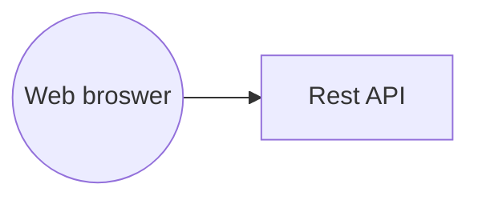

# Parcial final ARSW - Nicolas Garcia
- El diseño de esta aplicacion implementa un cliente pesado el cual se comunica un servicio rest api en cuanto patrones de diseño se implemento el principio open closed por lo que presenta una gran facilidad al momento de extender ya que se utilizaron abstracciones al momento de la creacion lo que permite un bajo acoplamiento por ejemplo lo 	lo que es la abstraccion de los servicios que se utiliza e manera correcta gracias a la injeccion de dependencias implementada con las antaciones en springboot, en cuanto a la funcionabilidad este servicio ofrece una total exactitud en las conversiones ahorrando tiempo de calculo, en cuanto a la fiabilidad este servicio es alta mente tolerante a los errores manteniendo el servicio ademas en terminos de eficiencia se presenmta un servicio altamente rapido y versatil.

 [link Github](https://github.com/nicoga97/Parcial-Final-ARSW)
  [link Heroku](https://parcial-arsw-2018-2.herokuapp.com/)

  ### Diagrama de arquitectura

